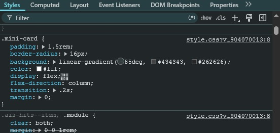

# Clases - plataforma Jefferson_nuevo_repository
 🎓

¡Hola! Bienvenido a mi repositorio. Este espacio está destinado a almacenar todos los apuntes, ejercicios, prácticas y proyectos que voy desarrollando durante mis clases en la plataforma **Jefferson_nuevo_repository**.

---

## 📂 Estructura del Repositorio

Aquí encontrarás los archivos organizados por módulos o materias:

* **`/Clase 7`**: Ejercicios creados en la clase 7.
* **`/Clase 8`**: Ejercicios creados en la clase 8.
* **`/Index.html `**:   Arquitecto visual 
---

## 👨‍💻 Autor

* **Jefferson Mejia** - *Estudiante / Desarrollador* * [Mi Perfil de GitHub](https://github.com/jeffersonmejia93edit/_Jefferson_nuevo_repository.git) *

---

## 🚀 Sobre la plataforma
Este repositorio es un reflejo del proceso de aprendizaje continuo en [Jefferson_nuevo_repository](#).


## 🚀 La Pokédex Digital de la Comunidad, Correcion Codigo Css y como utilizar correctamente el css dentro de una tarjeta-info

## Investigación Técnica: Familias tipográficas genéricas

Según la documentación oficial de MDN, la propiedad `font-family` permite utilizar familias tipográficas genéricas como `serif`, `sans-serif`, `monospace`, `cursive`, `fantasy` y `system-ui`. Estas familias sirven como alternativas cuando una fuente específica no está disponible en el dispositivo del usuario. :contentReference[oaicite:0]{index=0}

### Diferencia entre serif y sans-serif

- **Serif:** Las letras tienen pequeños remates o adornos en los extremos de sus trazos. Ejemplos comunes son Times New Roman y Georgia. Este estilo suele dar una apariencia más tradicional y formal. 

- **Sans-serif:** Las letras no tienen remates; sus trazos terminan de forma simple y limpia. Ejemplos comunes son Arial, Helvetica y Open Sans. Este estilo ofrece una apariencia más moderna y minimalista. 

### Recomendación para pantallas digitales

Para la lectura en pantallas digitales recomiendo utilizar fuentes **sans-serif**, ya que sus formas simples y limpias suelen resultar más fáciles de leer en diferentes tamaños y resoluciones. Además, son ampliamente utilizadas en sitios web, aplicaciones y sistemas operativos modernos debido a su claridad visual. 

## Captura de pantalla del diagrama de caja



## Valores identificados

Al inspeccionar el elemento seleccionado con las herramientas de desarrollador del navegador se observaron los siguientes valores:

- Margin (exterior): 16px
- Padding (interior): 24px

Estos valores corresponden al modelo de caja (Box Model) mostrado por las DevTools.


## Auditoría Manual y Corrección de CSS

Durante la revisión del archivo `style.css` se identificaron tres errores de sintaxis:

1. **Falta de unidad de medida en la propiedad `width`:**
   - Error: `width: 300;`
   - Corrección: `width: 300px;`
   - Explicación: Las propiedades de tamaño requieren una unidad de medida válida como `px`, `%`, `em` o `rem`.

2. **Valor incorrecto en la propiedad `text-align`:**
   - Error: `text-align: centro;`
   - Corrección: `text-align: center;`
   - Explicación: CSS utiliza palabras clave en inglés, por lo que `centro` no es un valor reconocido.

3. **Falta de punto y coma al final de una declaración:**
   - Error: `font-family: Arial, sans-serif`
   - Corrección: `font-family: Arial, sans-serif;`
   - Explicación: Cada declaración CSS debe terminar con un punto y coma (`;`) para mantener una sintaxis correcta.

   ## Reto del Modelo de Caja

El problema de legibilidad de la tarjeta ocurre porque el texto está demasiado cerca de los bordes. Para crear espacio **dentro de la caja**, entre el contenido y el borde, se debe utilizar la propiedad **`padding`**.

La propiedad `margin` no resuelve este problema, ya que crea espacio **fuera** del elemento, separándolo de otros elementos de la página. En cambio, `padding` agrega espacio interno y mejora la lectura del contenido.

Se aplicó la siguiente corrección en el archivo `style.css`:

```css
.tarjeta-pokemon {
    background-color: darkred;
    color: white;
    width: 300px;
    margin: 20px;
    border-width: 2px;
    border-color: black;
    border-style: solid;
    padding: 10px;
}

 Conclusión

Separar el contenido (HTML) de la presentación (CSS) permite mantener un proyecto 
web más organizado y fácil de mantener. 

HTML define la estructura y el contenido 
de la página, mientras que CSS 
se encarga de su diseño y apariencia. 
Esta separación facilita la reutilización de estilos, simplifica las modificaciones 
visuales sin afectar el contenido y mejora 
la legibilidad del código, haciendo más 
eficiente el desarrollo y mantenimiento 
del sitio web.


